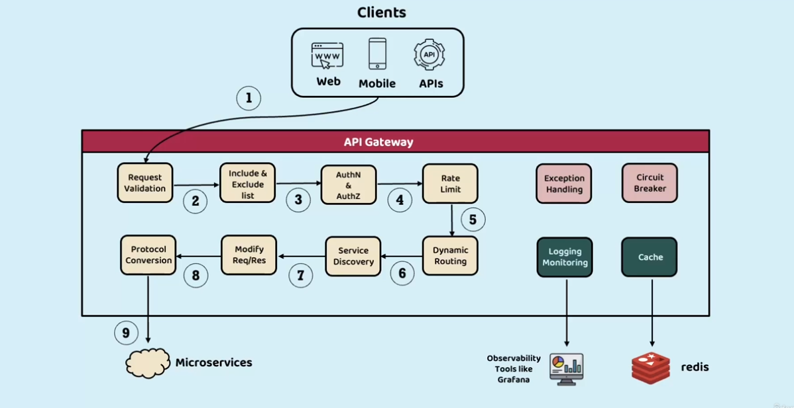
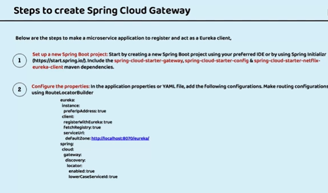
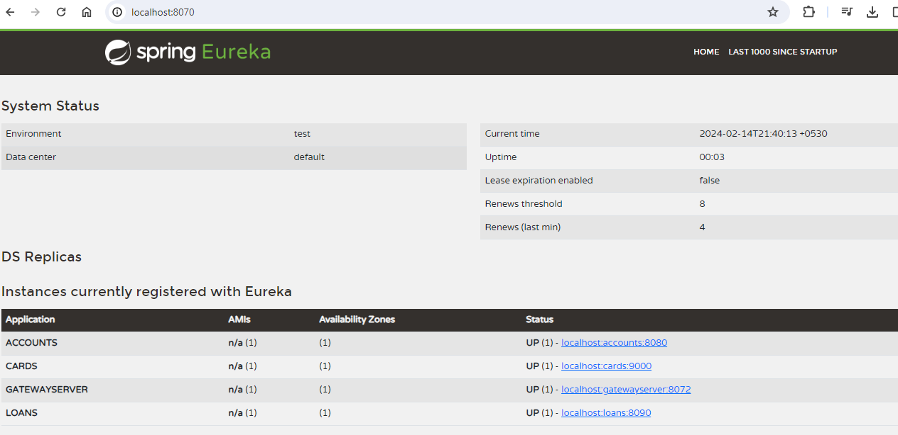
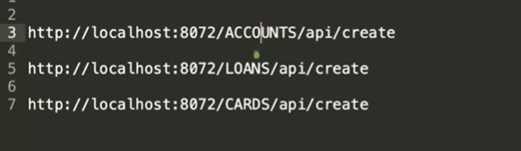
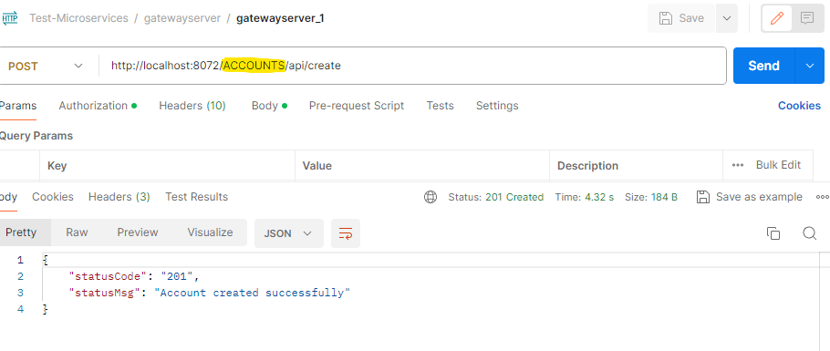
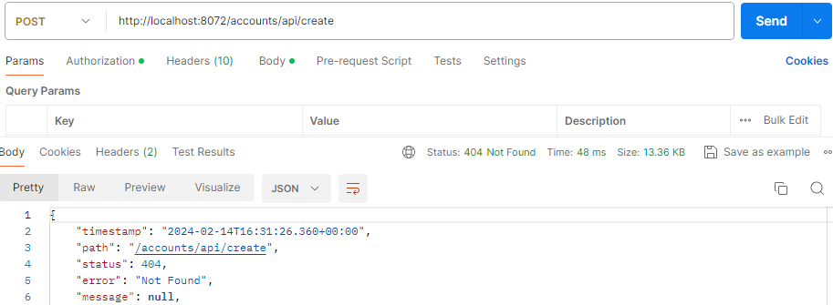
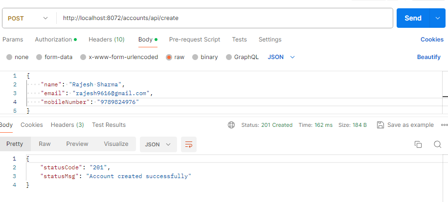

## API Gateway Some tasks



## Steps to create Spring Cloud Gateway 


## After Starting all Services in Sequence 
- Start Config Server
- Start Discovery Server once config server Start
- Start Microservice once Discovery Server Start
- Start Gateway Server


## Request
- Currently, we are sending request with Capital Letter (ACCOUNTS, LOANS, CARDS) : Reason is MS Name


- If we try sending with lower character


- Fix for above
```shell
    cloud.gateway.discovery.locator.lowerCaseServiceId =  true
```
  

          


## Steps

- Start DB. If Docker is used for MYSQLDB
```sh
docker run -p 3306:3306 --name accountsdb -e MYSQL_ROOT_PASSWORD=root -e MYSQL_DATABASE=accountsdb -d mysql
docker run -p 3307:3306 --name loansdb -e MYSQL_ROOT_PASSWORD=root -e MYSQL_DATABASE=loansdb -d mysql
docker run -p 3308:3306 --name cardsdb -e MYSQL_ROOT_PASSWORD=root -e MYSQL_DATABASE=cardsdb -d mysql
```


- Start Config Server
- Start Discovery Server once config server Start--> Dependency
- Start Microservice once Discovery Server Start--> Dependency
- Start Gateway Server

