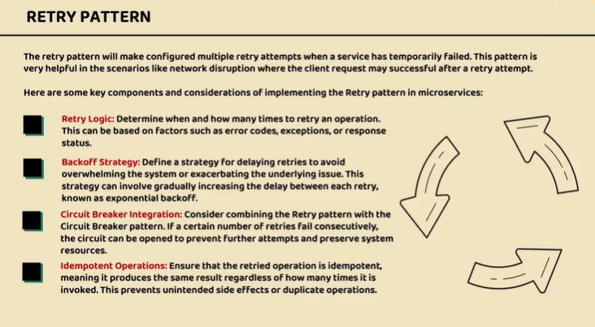
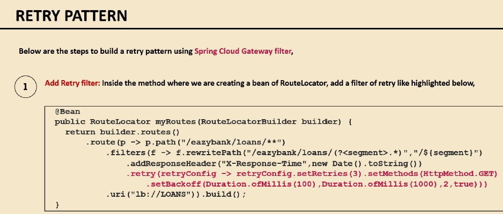
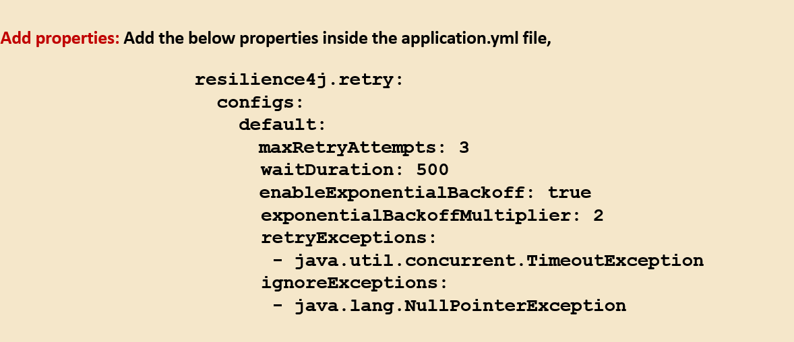
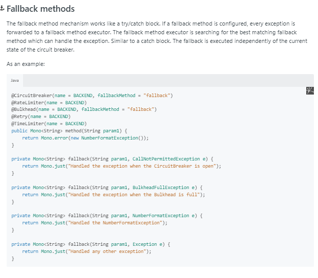
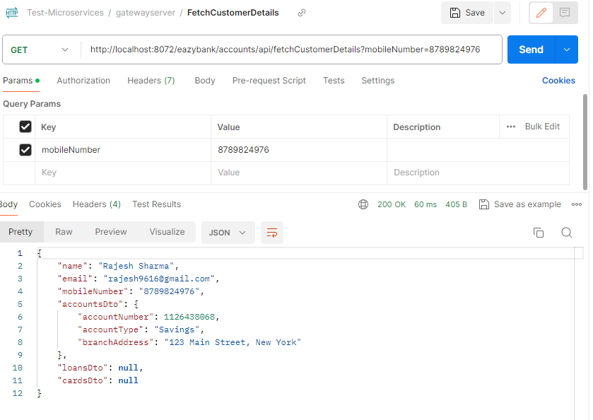

## Spring Cloud Official Document
- https://spring.io/projects/spring-cloud-circuitbreaker
- https://cloud.spring.io/spring-cloud-static/spring-cloud-circuitbreaker/1.0.2.RELEASE/reference/html/
- https://reflectoring.io/retry-with-resilience4j/
## Resilience4j Official Document
- https://resilience4j.readme.io/docs/getting-started-3

## Problem
- 

## Issue Solve by Resilience
- 
- 

## Circuit Breaker Pattern
- 


## Circuit Breaker Pattern Implementation
Dependency
```shell
   <dependency>
	  <groupId>org.springframework.cloud</groupId>
	  <artifactId>spring-cloud-starter-circuitbreaker-reactor-resilience4j</artifactId>
   </dependency>
```
Implementation for Gateway Server
- 
Implementation for MicroService 
- https://docs.spring.io/spring-cloud-openfeign/docs/current/reference/html/#spring-cloud-feign-circuitbreaker
- 

## HTTP Timeout Configuration
https://docs.spring.io/spring-cloud-gateway/reference/spring-cloud-gateway/http-timeouts-configuration.html

## Retry Pattern
-- Retry Configuration https://reflectoring.io/retry-with-resilience4j/

## Retry Pattern Implementation in gateway MS


## Retry Pattern for Normal MS




## After Starting all Services in Sequence 
- Start Config Server
- Start Eureka Discovery Server once config server Start
- Start Microservice once Discovery Server Start
- Start Gateway Server



## Fetch Customer Details


## Starting DB
```shell
docker run -p 3306:3306 --name accountsdb -e MYSQL_ROOT_PASSWORD=root -e MYSQL_DATABASE=accountsdb -d mysql
docker run -p 3307:3306 --name loansdb -e MYSQL_ROOT_PASSWORD=root -e MYSQL_DATABASE=loansdb -d mysql
docker run -p 3308:3306 --name cardsdb -e MYSQL_ROOT_PASSWORD=root -e MYSQL_DATABASE=cardsdb -d mysql
```
## All Requests
[Microservices.postman_collection.json](Microservices.postman_collection.json)