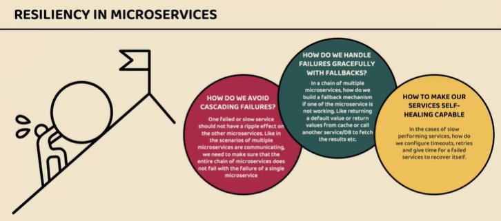
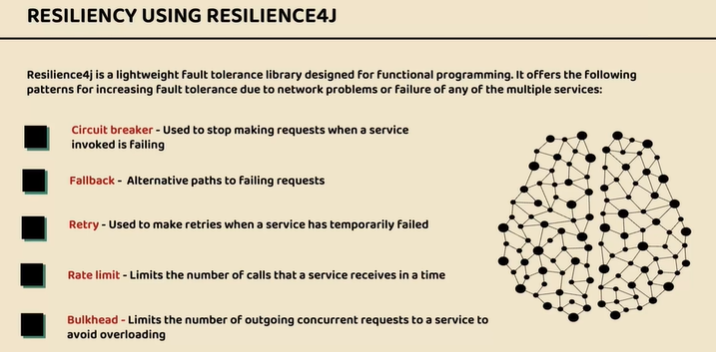

## Spring Cloud Official Document
- https://spring.io/projects/spring-cloud-circuitbreaker
- https://cloud.spring.io/spring-cloud-static/spring-cloud-circuitbreaker/1.0.2.RELEASE/reference/html/

## Resilience4j Official Document
- https://resilience4j.readme.io/docs/getting-started-3

## Problem
- 

## Issue Solve by Resilience
- 
- 

## Circuit Breaker Pattern
- 


## Circuit Breaker Pattern Implementation
Dependency
```shell
   <dependency>
	  <groupId>org.springframework.cloud</groupId>
	  <artifactId>spring-cloud-starter-circuitbreaker-reactor-resilience4j</artifactId>
   </dependency>
```
- 
- 

## After Starting all Services in Sequence 
- Start Config Server
- Start Eureka Discovery Server once config server Start
- Start Microservice once Discovery Server Start
- Start Gateway Server

## All Requests
[Microservices.postman_collection.json](Microservices.postman_collection.json)