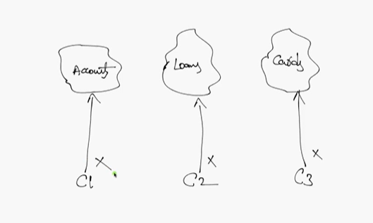
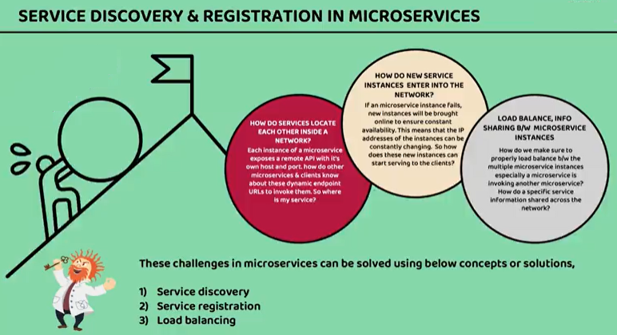
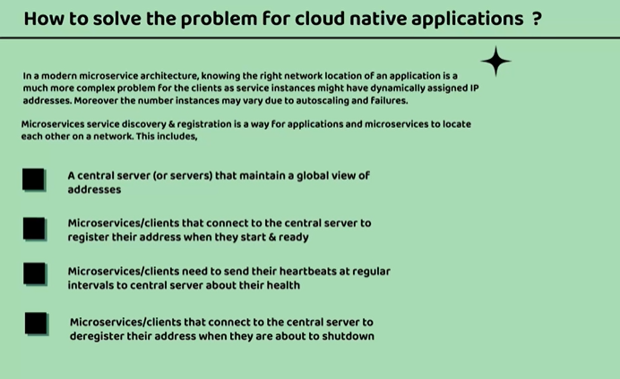
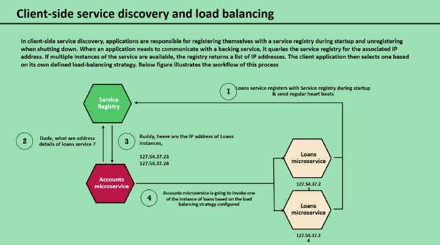
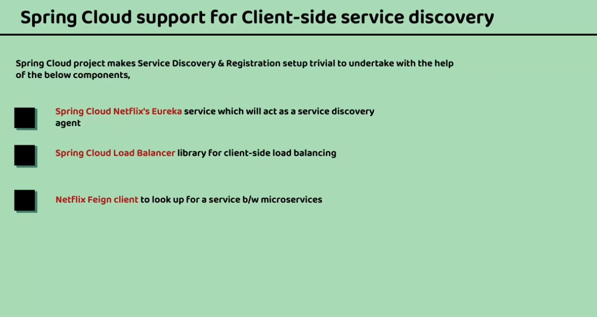

## Discovery Server




## Problem's we will solve using Discovery Server



## Solution



## Load Balancer



## Terminology Used


## Spring Cloud Support for Client-side Service Discovery


## Steps

- Start DB. If Docker is used for MYSQLDB
```sh
docker run -p 3307:3306 --name accountsdb -e MYSQL_ROOT_PASSWORD=root -e MYSQL_DATABASE=accountsdb -d mysql
docker run -p 3308:3306 --name loansdb -e MYSQL_ROOT_PASSWORD=root -e MYSQL_DATABASE=loansdb -d mysql
docker run -p 3309:3306 --name cardsdb -e MYSQL_ROOT_PASSWORD=root -e MYSQL_DATABASE=cardsdb -d mysql
```


- Start Config Server
- Start Discovery Server once config server Start--> Dependency
- Start Microservice once Discovery Server Start--> Dependency


