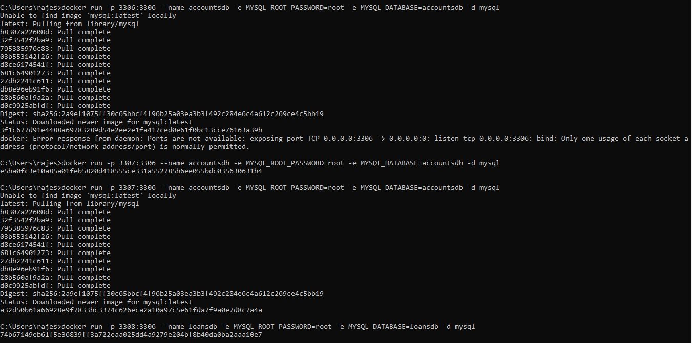

** Docker MYSQL **
docker run -p 3307:3306 --name accountsdb -e MYSQL_ROOT_PASSWORD=root -e MYSQL_DATABASE=accountsdb -d mysql

docker run -p 3308:3306 --name loansdb -e MYSQL_ROOT_PASSWORD=root -e MYSQL_DATABASE=loansdb -d mysql

docker run -p 3309:3306 --name cardsdb -e MYSQL_ROOT_PASSWORD=root -e MYSQL_DATABASE=cardsdb -d mysql

