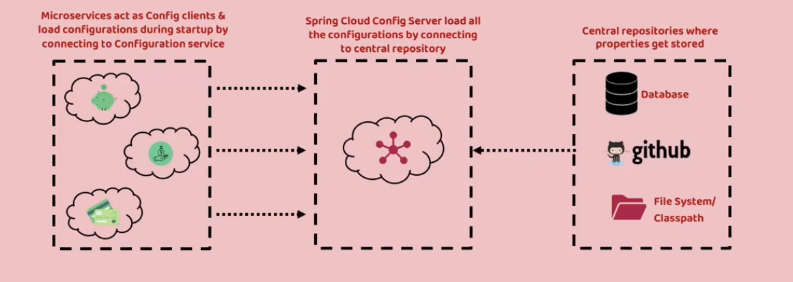

H2 DB
Open in browser
 http://localhost:8080/h2-console/
 
Swagger-UI
	http://localhost:8080/swagger-ui/index.html

learning :  https://spring.io/microservices

**Externalize Properties using Cloud Config**

**Read Configration file from class Path**
spring:
  profiles:
    active: git

**From which Location read config properties**
cloud:
    config:
        server:
            git:
                uri: "https://github.com/sharmarajeshkr/sharma-config-server.git"
                default-label: main  ## From Which Branch
                timeout: 5  ## Time out after 5 sec
                clone-on-start: true ## Clone repo on start up, If false then cloning will happen at first request
                force-pull: true ## If any local chages happen in this repo , ignore those and pull from master branch

Read Properties form Config Server
1. Add Dependency
   <dependency>
      <groupId>org.springframework.cloud</groupId>
      <artifactId>spring-cloud-starter-config</artifactId>
   </dependency>
   <DependencyManagement> ... <dependencyManagemnt>
2. Yml : Import configrtion files from config server
   config:
      import: "optional:configserver:http://localhost:8071/"

